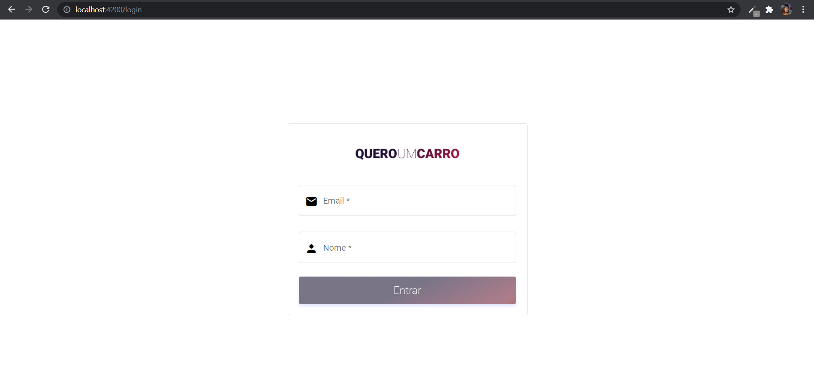
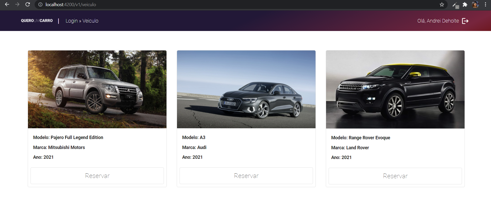
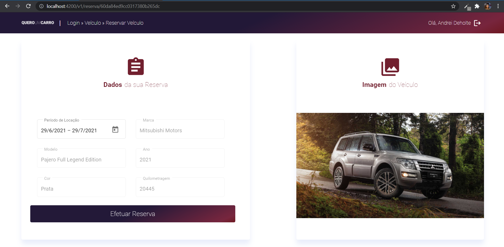
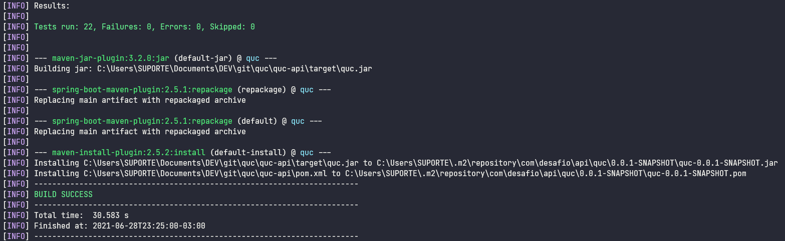

<h1 align="center">
<br>
  
<br>
<br>
</h1>

<p align="center">QueroUmCarro [QUC] é um sistema de aluguel de carros usado como exemplo para implementação da stack angular, springboot e mongodb utilizando swagger, javadoc, logs teste integrados e teste unitários.</p>

<hr>

# Como buildar o projeto

## Arquivos de configuração

Para o projeto webapp o aquivo de configuracao que será utilizado se encontra no diretorio: quc-webapp/src/environments/.

Para a base de dados o script de inicializacão se encontra na pasta: quc-db/mongo-init.js

Para o projeto da api o arquivo de configuracão se encontra na pasta: quc-api/src/main/resources/application.properties

## Build dos projetos

Execute o comando abaixo em um terminal para gerar o artefato jar da api dentro do diretório _quc-api_.

```
mvn clean install 
```

Esse comando executará os testes também do projeto java. Após concluído execute o comando abaixo na pasta _quc-webapp_.

```
npm run build
```

Volte para a pasta raíz do projeto, nela encontrará um arquivo docker-compose.yml que pode ser utilizado para buildar o projeto através de containers docker, incluindo a base de dados. Execute o comando abaixo para criar os containers:

```
docker-compose -f docker-compose.yml -d --build
```

## Webapp

O projeto será exposto na url: http://localhost:4200/login

## API

A API será exposta na url: http://localhost:24000

## Mongo Express

O projeto expõe o mongo express no recurso: http://localhost:8081/db/quc_db/. Com ele você poderá consultar a base de dados através da interface http.

# Screenshots do sistema

<h1 align="center">
<br>
  
<br>
<br>
  
<br>
<br>
  
<br>
<br>
  
</h1>
